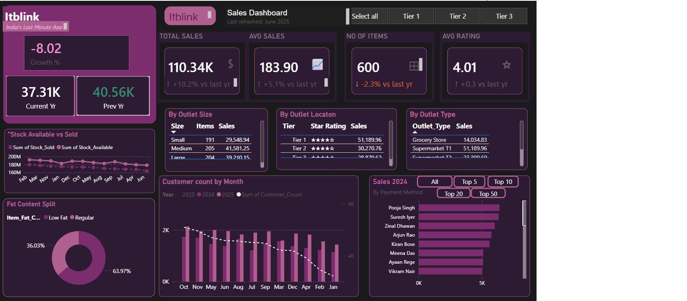

# 🛒 Blinkit Sales Dashboard

## 📊 Project Overview
Power BI dashboard analyzing Blinkit sales data with 
interactive visualizations and KPI tracking.

## 🎨 Color Theme
Dark purple theme (#1A1A1C, #2D1B33, #7B2D6E, #B06090)

## 📈 Features
- KPI Cards (Total Sales, Avg Sales, Items, Rating)
- Sales by Item Type (Bar Chart)
- Fat Content Split (Donut Chart)
- Customer Counts by Month (Bar + Line Chart)
- Top N Customer Filter (5/10/20/50)
- Outlet Analysis Tables
- Inventory Gauges
- Tier Filter Buttons

## 🗂️ Dataset
- 600 transactions
- Sales_Data, Customer_Counts, Inventory_Data tables

## 🛠️ Tools Used
- Microsoft Power BI Desktop
- Microsoft Excel
- DAX Measures

## 📸 Dashboard Preview
Power BI Sales Dashboard Project
